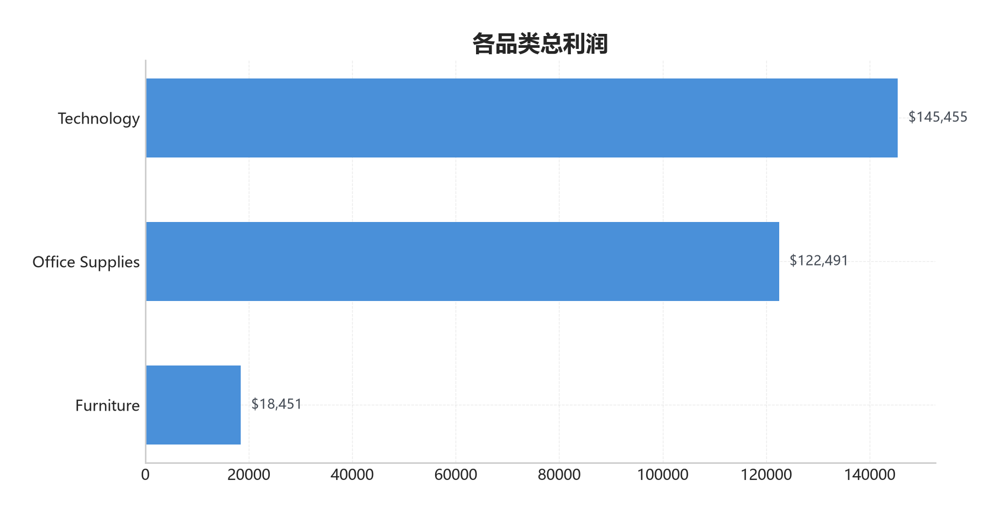
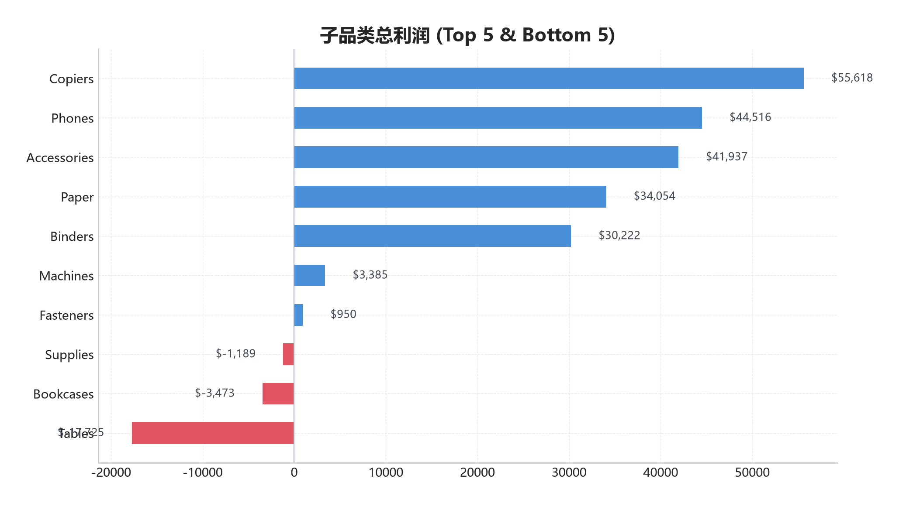
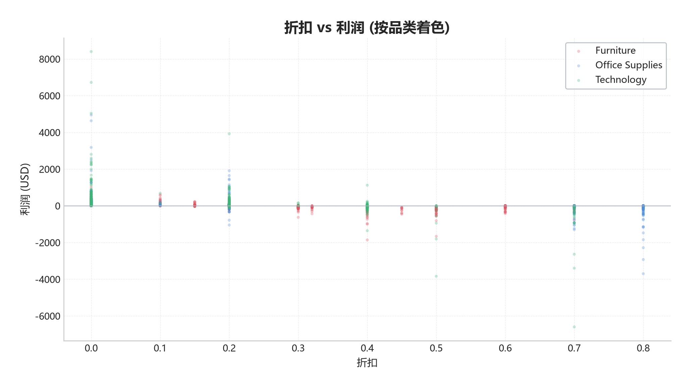
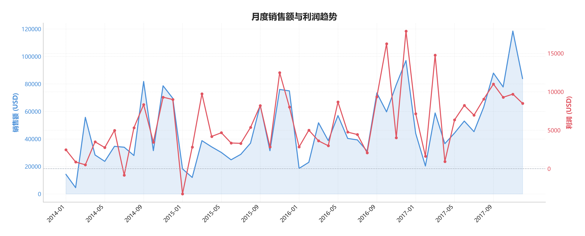
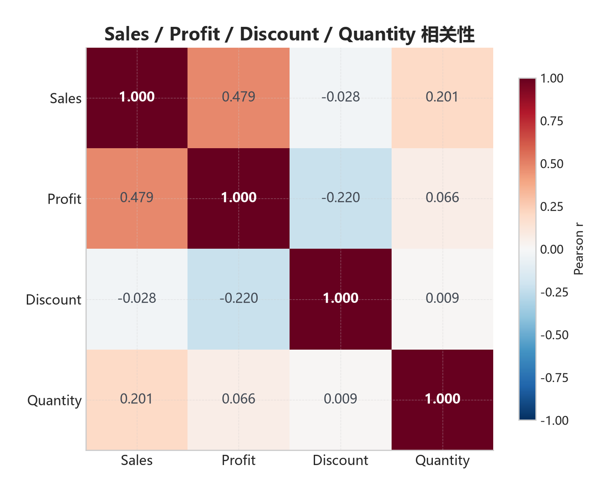

# Superstore 超市销售数据分析

> 随着市场需求不断增长，竞争日益激烈，有一家大型连锁超市的数据集，为找到如何才能取得最佳效果。超市希望了解应该重点关注哪些产品、地区、品类和客户群体，以及应该避免哪些方面，做出如下数据分析结果。

## 数据概览

| 指标 | 数值 |
|------|------|
| 数据规模 | 9,994 条订单记录，21 个字段 |
| 时间跨度 | 2014-01 ~ 2017-12（4 年） |
| 品类 | 3 大类（Furniture / Office Supplies / Technology） |
| 子品类 | 17 个子品类 |
| 地区 | 4 大区域（West / East / Central / South） |
| 客户细分 | Consumer / Corporate / Home Office |

## 核心发现

### 整体指标

| 指标 | 数值 |
|------|------|
| 总销售额 | $2,297,201 |
| 总利润 | $286,397 |
| 整体利润率 | 12.5% |
| 亏损订单占比 | 18.7% |

### 品类分析

Technology 以 **$145,455** 总利润和 **17.4%** 利润率排名第一。Furniture 利润率仅 2.5%，但销售额居首——高销售额低利润，说明 Furniture 成本或折扣管理存在严重问题。



### 子品类分析

**Top 5 盈利子品类：** Copiers（$55,618）、Phones（$44,516）、Accessories（$41,937）、Paper（$34,054）、Binders（$30,222）

**Bottom 5 亏损/低利润：** Tables（-$17,725）、Bookcases（-$3,473）、Supplies（-$1,189）、Fasteners（+$950）、Machines（+$3,385）



### 地区分析

| 地区 | 总利润 | 利润率 |
|------|--------|--------|
| West | $108,418 | 14.9% |
| East | $91,523 | 13.5% |
| South | $46,749 | 11.9% |
| Central | $39,706 | 7.9% |

**West 和 East 贡献了总利润的 70%，应加大投入。** Central 利润率明显偏低，需关注运营效率。

### 客户细分

| 客户群体 | 总利润 | 利润率 | 客单价 |
|----------|--------|--------|--------|
| Consumer | $134,119 | 11.6% | $224 |
| Corporate | $91,979 | 13.0% | $234 |
| Home Office | $60,299 | 14.0% | $241 |

**Home Office 利润率最高，Corporate 次之。** Consumer 虽然利润总额最大，但利润率最低。建议加大 Home Office 和 Corporate 群体的精准营销力度。

### 折扣影响

| 折扣档位 | 亏损率 | 订单占比 |
|----------|--------|----------|
| 无折扣 | 0.0% | 48.0% |
| 低折扣 (1-20%) | 13.8% | 38.0% |
| 中折扣 (21-40%) | 90.2% | 4.6% |
| 高折扣 (>40%) | **100.0%** | 9.3% |

折扣是利润的头号杀手。中高折扣订单（折扣 > 20%）仅占 14% 的订单量，却造成了几乎所有亏损。**严格控制折扣审批是扭转亏损最直接的手段。**



### 月度趋势



销售额呈明显季节性波动：Q3-Q4 为旺季（8-12 月），Q1 为淡季。但利润趋势并非与销售额完全同步，部分高销售月份利润反而低迷——说明旺季促销折扣侵蚀了利润。

### 数值相关性



- **Sales 与 Profit 相关系数 0.48** — 中等正相关，并非销售额越高利润越高
- **Discount 与 Profit 相关系数 -0.22** — 折扣越大，利润越低，符合预期
- Discount 与 Sales 几乎无相关性（-0.03）—— 打折并不能有效提升销售额

## 建议关注

1. **子品类【Copiers】总利润 $55,618** — 核心盈利来源
2. **子品类【Phones】总利润 $44,516** — 核心盈利来源
3. **子品类【Accessories】总利润 $41,937** — 核心盈利来源
4. **地区【West】利润最高 ($108,418)** — 加大投入
5. **客户群体【Home Office】利润率最高 (14.0%)** — 精准营销
6. **产品【Canon imageCLASS 2200 Advanced Copier】(Copiers)** — 利润 $25,200，明星单品
7. **产品【Fellowes PB500 Electric Punch Plastic Comb Binding】(Binders)** — 利润 $7,753，明星单品
8. **产品【Hewlett Packard LaserJet 3310 Copier】(Copiers)** — 利润 $6,984，明星单品

## 风险提示

1. **子品类【Tables】总利润 -$17,725** — 持续亏损需复盘
2. **子品类【Bookcases】总利润 -$3,473** — 持续亏损需复盘
3. **子品类【Supplies】总利润 -$1,189** — 持续亏损需复盘
4. **高折扣(>40%)订单亏损率 100.0%** — 严控高折产品审批
5. **产品【Cubify CubeX 3D Printer Double Head Print】亏损 $8,880** — 考虑下架或改定价
6. **产品【Lexmark MX611dhe Monochrome Laser Printer】亏损 $4,590** — 考虑下架或改定价

## 项目结构

```
superstore_analysis/
├── superstore.csv                  # 数据集（9,994 行 × 21 列）
├── data_analysis.py                # 分析脚本（单一入口）
├── requirements.txt                # Python 依赖
├── README.md                       # 本文档
└── outputs/
    └── charts/
        ├── analysis_results.json   # 结构化分析结果
        ├── 01_profit_by_category.png
        ├── 02_profit_by_subcategory.png
        ├── 03_profit_by_region.png
        ├── 04_profit_by_segment.png
        ├── 05_discount_vs_profit.png
        ├── 06_monthly_trends.png
        ├── 07_top10_products.png
        ├── 09_category_segment_heatmap.png
        ├── 10_region_category_heatmap.png
        ├── 11_profit_margin_boxplot.png
        └── 12_correlation_heatmap.png
```

